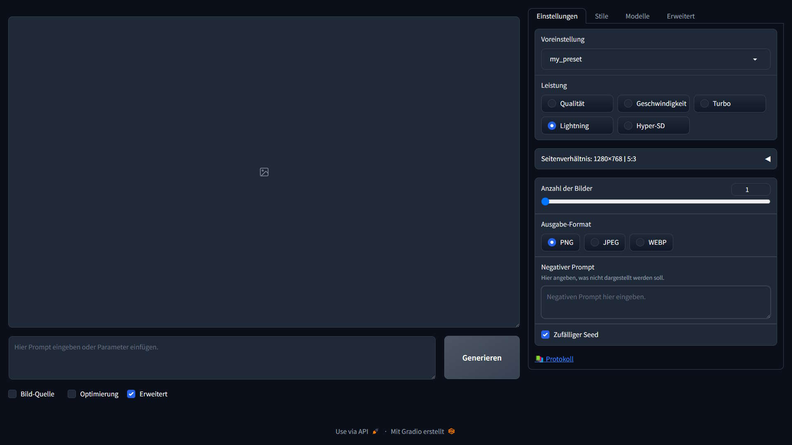

# Tipps und Tricks&nbsp;– Fooocus&nbsp;– Deutsch  
Tipps und Tricks für Computer und Internet.
---
Fooocus ist ein Web-UI für Stable Diffusion. Es ist damit möglich, SD ziemlich einfach zu installieren.

## Fooocus Web-UI in Deutsch



Hier sind Infos darüber, wie das WebUI auf die deutsche Sprache umgestellt wird.

Nach der Installation ist das Fooocus-Web-UI nur in englischer Sprache verfügbar. Dies lässt sich recht einfach ändern. Benötigt wird eine Sprachdatei im JSON-Format mit den übersetzten Texten und eine angepasste BAT-Datei, um das Web-UI mit den passenden Parametern zu starten.

Beide Dateien sind in diesem Ordner auffindbar.

## Installation&nbsp;– Windows
Die deutsche Sprachdatei ``de.json`` muss in den Ordner ``Foocus\language`` kopiert werden. Die Datei ``run-de.bat`` gehört in den Installations-Ordner von Fooocus.

Anschließend wird Fooocus mit der Batch-Datei  ``run-de.bat`` in deutscher Sprache gestartet.

## Anpassen der Übersetzung
Die Sprachdatei ``de.json`` kann einfach mit einem TXT-Editor bearbeitet und an die eigenen Wünsche angepasst werden. Somit ist es nat. auch möglich andere Sprachen für das Web-UI zu erstellen. Die BAT-Datei sollte dann anschließend an die neue Sprache angepasst werden.

Wichtig ist die Angabe hinter ``-language``. Diese muss dem Namen der Sprachdatei (ohne Dateiendung .json) enthalten.

### Beispiel

Hier ein einfaches Beispiel für eine angepasste BAT-Datei:

```
.\python_embeded\python.exe -s Fooocus\entry_with_update.py --language de
```

Sollte die Sprach-Datei nicht geladen werden können, startet Fooocus einfach in der vorgegebenen englischen Sprache. Fehler werden in der Terminalausgabe angezeigt.

