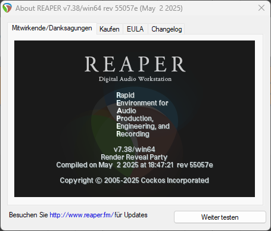

# Tipps und Tricks / Audio/Video-Creation / DAW / REAPER

<small>TIPPS UND TRICKS FÜR COMPUTER UND INTERNET</small>

Hier sind Tipps und Tricks zu REAPER.

---

## REAPER

*REAPER* (**R**apid **E**nvironment for **A**udio **P**roduction, **E**ngineering and **R**ecording) ist eine kostengünstige[^1] DAW. Eine 60 Tage gültige kostenlose Testversion, ohne Funktionseinschränkungen, kann beim Anbieter heruntergeladen werden. – Eine Digital Audio Workstation (DAW) ist ein System aus digitalen Geräten, das für die Aufnahme und Bearbeitung von Audiosignalen bei Musikproduktion, Tonaufnahmen, Abmischung und Mastering genutzt wird. Der Begriff steht heute meistens für ein computergestütztes System, das aus spezieller Hardware wie einer hochwertigen Audiokarte und passender Musiksoftware besteht. Früher bezeichnete man damit Geräte für Harddisk-Recording, bevor die Aufnahme und Bearbeitung von Audio über PCs oder Macs möglich war.[^2]

---

### Screenshot

Screenshot: About Reaper

---

### Website

* REAPER – [www.reaper.fm](https://www.reaper.fm/)

---

#### RePack

Paket-Manager für REAPER

Mit *RePack* lassen sich VST-Plugins und -Instrumente einfach verwalten und installieren.

* ReaPack – [reapack.com](https://reapack.com/)

[^1]: 60 Tage Testversion, ohne Funktionseinschränkungen
[^2]: Text mit Unterstützung von KI erstellt.

---

[KLiNG0NE](https://github.com/KLiNG0NE/) / [Tipps-und-Tricks](https://github.com/KLiNG0NE/Tipps-und-Tricks) / [Fire TV](README.md)
