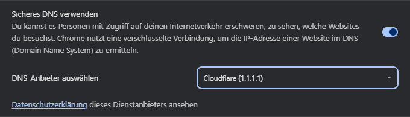
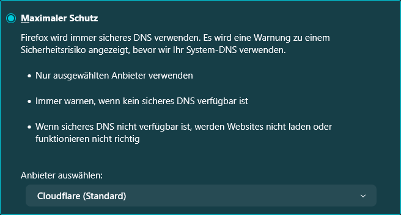
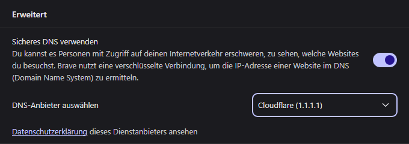

# DNS over HTTPS (DoH)

Bei DNS over HTTPS werden anfragen an den DNS-Server verschlüsselt übertragen. Dies verhindert, dass andere, zum Beispiel der Internetprovider, weiß, welche Websites oder Dienste angefragt werden.

## Übersicht

- [Chrome](#chrome)
- [Firefox](#firefox)
- [Brave](#brave)
- [DNS over HTTPS (DoH) manuell einrichten](#dns-over-https-doh-manuell-einrichten)

---

## Chrome

⁝ (Drei-Punkte-Menü) -> Einstellungen -> Datenschutz und Sicherheit -> Sicheres DNS verwenden

Hier einen Anbieter wählen oder manuell konfigurieren.

---

## Firefox

☰ (Burger-Menü) -> Einstellungen -> Datenschutz & Sicherheit -> DNS über HTTPS

"Maximaler Schutz" auswählen und einen Anbieter wählen oder manuell konfigurieren.

- Maximaler Schutz – Es werden nur gesicherte DNS-Anfragen zugelassen.
- Erhöter Schutz – Bei Problemen mit DoH wird der Standard-DNS-Resolver genutzt.
- Standardschutz – Der Browser entscheidet, wann DoH genutzt wird.

---

## Brave

☰ (Burger-Menü) -> Einstellungen -> Datenschutz und Sicherheit -> Sicherheit -> Erweitert -> Sicheres DNS verwenden

Hier einen Anbieter wählen oder manuell konfigurieren.

---

## DNS over HTTPS (DoH) manuell einrichten

Falls der Browser manuell eingerichtet wird, sind unter *DoH-Resolver* in der folgenden Tabelle korrekte URLs angegeben.  
Meiner Erfahrung nach, muss das "https://" nicht mit angegeben werden, schadet aber auch nicht.

#### Öffentliche DoH-Resolver

| Anbieter                                                                           | DoH-Resolver                                                                 | Hinweise
|------------------------------------------------------------------------------------|------------------------------------------------------------------------------| --------
| [Cloudflare](https://developers.cloudflare.com/1.1.1.1/dns-over-https/)            | [cloudflare-dns.com/dns-query](https://cloudflare-dns.com/dns-query)         | Schneller Resolver
| [DNS4EU](https://www.joindns4.eu/for-public#resolver-options)                      | [unfiltered.joindns4.eu/dns-query](https://unfiltered.joindns4.eu/dns-query) | Europäischer Anbieter
| [Google](https://developers.google.com/speed/public-dns/docs/doh/)                 | https://dns.google/dns-query                                                 | Schneller Resolver
| [Quad9](https://quad9.net/de/)                                                     | https://dns.quad9.net/dns-query                                              | Schweiz, erhöhter Schutz
| [SaveDNS](https://docs.safedns.com/books/hidden/page/dns-over-https-setup-doh-url) | [doh.safedns.com](https://doh.safedns.com)                                   | USA, erhöhter Schutz
| [DNS.SB](https://dns.sb/)                                                          | [doh.sb/dns-query](https://doh.sb/dns-query)                                 | Deutscher Anbieter

Quelle: [dnsprivacy.org](https://dnsprivacy.org/public_resolvers/)  
Weitere DNS-Resolver: [github.com/curl](https://github.com/curl/curl/wiki/DNS-over-HTTPS#publicly-available-servers)
