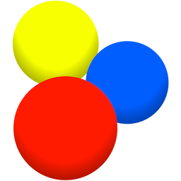

# KLiNG0NE / Tipps-und-Tricks / Browser

* [Plug-ins](#plug-ins)
  * [Download](#download)
  * [Lesezeichen-/Favoritenverwaltung](#lesezeichen-favoritenverwaltung)
  * [Websitefilter](#websitefilter)
  * Twitch
  * [YouTube](#youtube)

## Browser

* Chromiumbasiert
  * Google Chrome - [www.google.com](https://www.google.com/intl/de_de/chrome/ "https://www.google.com")
  * Brave - [brave.com](https://brave.com/de/ "https://brave.com")
  * Microsoft Edge - [www.microsoft.com](https://www.microsoft.com/de-de/edge/ "https://www.microsoft.com")
  * Ungoogled Chromium
  * Opera - undurchsichtige Besitzverhältnisse - [www.opera.com](https://www.opera.com/de "https://www.opera.com")
  * Arc - Tableiste an der Seite - [arc.net](https://arc.net/ "https://arc.net") (engl.)
* Firefoxbasiert
  * Mozilla Firefox - [www.firefox.com](https://www.firefox.com/de/ "https://www.firefox.com")
  * LibreWolf - [librewolf.net](https://librewolf.net/ "https://librewolf.ne")
  * Waterfox - [www.waterfox.net](https://www.waterfox.net/ "https://www.waterfox.net")
  * Floorp - Open Source [floorp.app](https://floorp.app/ "https://floorp.app") (engl.)
  * Zen Browser - Abspaltung von Mozilla Firefox, Open Source
  * Tor Browser - [www.torproject.org](https://www.torproject.org/ "https://www.torproject.org")
* Unabhängig
  * Ladybird - noch in Entwicklung - Website: [ladybird.org](https://ladybird.org/ "ttps://ladybird.org")

## Plug-ins

Ein Plug-in [ˈplʌgɪn] (häufig auch Plugin; von engl. to plug in, „einstöpseln, anschließen“, auch Software-Erweiterung oder Zusatzmodul) ist eine optionale Softwarekomponente, die eine bestehende Software oder ein Computerspiel erweitert bzw. verändert. Der Begriff wird teilweise auch als Synonym zu „Add-on“ und „Add-in“ benutzt. Plug-ins werden meist vom Benutzer installiert und dann von der entsprechenden Hauptanwendung während der Laufzeit eingebunden. Plug-ins können nicht ohne die Hauptanwendung ausgeführt werden[^1].

### Download

#### Video DownloadHelper

 

Mit *Video DownloadHelper* können recht einfach Videos von Websites heruntergeladen werden.

Website: [www.downloadhelper.net](https://www.downloadhelper.net/ "Video DownloadHelper")

---

### Lesezeichen-/Favoritenverwaltung

#### Floccus

Bietet verschiedene Speichermöglichkeiten für die Favoriten.

Website: [floccus.org](https://floccus.org/ "floccus.org")

---

#### xBrowserSync

 

Speichert online die Lieblingswebsites und kann zwischen verschiedenen Browsern sowie Android synchronisieren.

Website: [www.xbrowsersync.org](https://www.xbrowsersync.org/ "xBrowserSync.org")

---

### Websitefilter

#### uBlock origin

 

Effektive Website-Filterung durch Nutzung von unterschiedlichen Filterlisten.  (Werbung, Social-Networks, ...)

Website: [ublockorigin.com](https://ublockorigin.com/ "uBlockOrigin.com")

---

#### Ghostery

 

Ghostery bietet mehrere Anwendungen, die zusammenarbeiten, um einen optimalen Schutz der Privatsphäre zu gewährleisten. Ganz gleich, ob Sie einen Werbeblocker, einen Tracker-Neutralisierer oder eine private Suchmaschine benötigen, Ghostery hat alles für Sie[^2].

Website: [www.ghostery.com](https://www.ghostery.com/ "Ghostery.com")

---

#### Privacy Badger

 

Privacy Badger ist eine Browsererweiterung, die Werbetreibende und andere Drittanbieter davon abhält, heimlich zu verfolgen, wohin Sie gehen und welche Seiten Sie sich im Internet ansehen. Wenn ein Werbetreibender Sie ohne Ihre Erlaubnis über mehrere Websites hinweg verfolgt, blockiert Privacy Badger automatisch, dass dieser Werbetreibende weitere Inhalte in Ihrem Browser lädt. Für den Werbetreibenden ist es so, als wären Sie plötzlich verschwunden[^3].

Website: [privacybadger.org](https://privacybadger.org/ "privacybadger.org")

---

#### I don't care about cookies

   

Zu deutsch: Cookies sind mir egal. – Filtert die Cookie-Hinweise von Websites heraus.

Website: [www.i-dont-care-about-cookies.eu](https://www.i-dont-care-about-cookies.eu/de "i-dont-care-about-cookies.eu")

---

### YouTube

#### SponsorBlock

 

SponsorBlock ist eine Open-Source-Browser-Erweiterung und eine offene API zum Überspringen von Sponsor-Segmenten in YouTube-Videos. Nutzer melden sich, wenn ein Sponsor in der Erweiterung auftaucht, und die Erweiterung überspringt automatisch die Sponsoren, von denen sie weiß, indem sie ein Abfragesystem verwendet, das die Privatsphäre schützt. Sie unterstützt auch das Überspringen anderer Kategorien, wie Intros, Outros und Erinnerungen zum Abonnieren, und das Überspringen zum Punkt mit Highlight[^4].

Website: [sponsor.ajay.app](https://sponsor.ajay.app/ "sponsor.ajay.app")

---

#### Return YouTube Dislike

 

Zeigt einen geschätzten Dislike-Wert bei YouTube an.

Website: [returnyoutubedislike.com](https://returnyoutubedislike.com/ "returnyoutubedislike.com")

---

[KLiNG0NE](https://github.com/KLiNG0NE/) / [Tipps-und-Tricks](https://github.com/KLiNG0NE/Tipps-und-Tricks/) / [Browser](https://github.com/KLiNG0NE/Tipps-und-Tricks/blob/main/Browser/ReadMe.md)

###### Quellenangaben:

[^1]: Seite „Plug-in“. In: Wikipedia – Die freie Enzyklopädie. Bearbeitungsstand: 26. Oktober 2024, 12:19 UTC. URL: [https://de.wikipedia.org/wiki/Plug-in](https://de.wikipedia.org/w/index.php?title=Plug-in&oldid=249773221) (Abgerufen: 25. Dezember 2024, 03:07 UTC) 
[^2]: Übersetzung der Herstellerwebsite: [www.ghostery.com](https://www.ghostery.com/)
[^3]: Übersetzung der Herstellerwebsite: [privacybadger.org](https://privacybadger.org/)
[^4]: Übersetzung der Herstellerwebsite: [sponsor.ajay.app](https://sponsor.ajay.app/)
