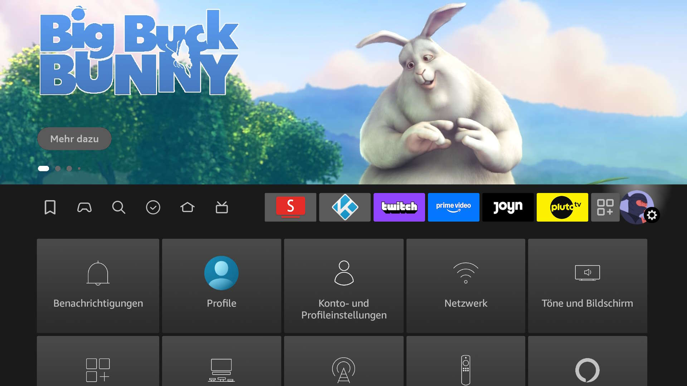
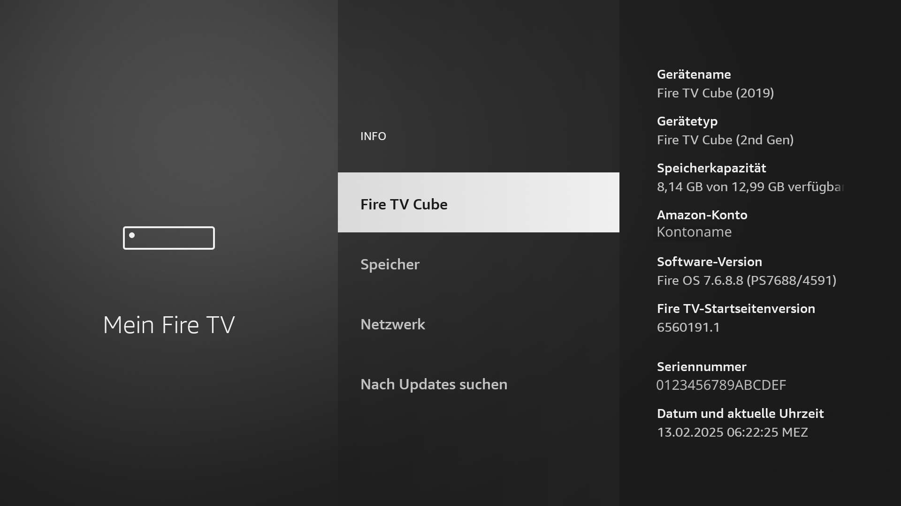
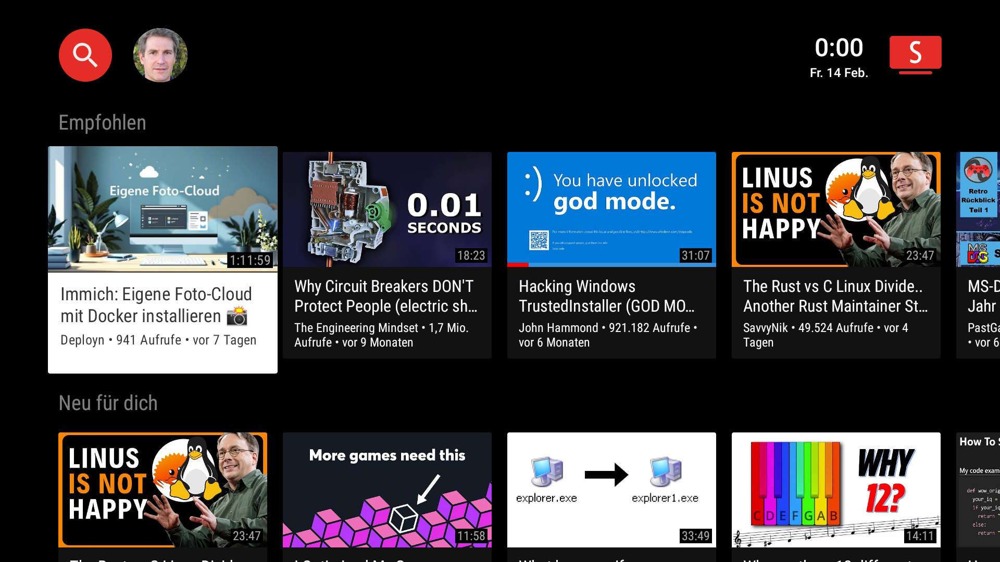

# Tipps und Tricks / Fire TV
<small>TIPPS UND TRICKS FÜR COMPUTER UND INTERNET</small>

Hier sind Tipps und Tricks zum Fire TV auffindbar.

* [Entwickleroptionen freischalten](#entwickleroptionen-freischalten)
* [Downloader](#downloader-apps-aus-dem-internet-laden) – Apps aus dem Internet laden
* [SmartTube](#smarttube-youtube-ohne-werbung) – YouTube ohne Werbung
* [KODI](#kodi-auf-fire-tv-installieren) auf Fire TV installieren

---

#### Screenshot: Fire TV



Die *Einstellungen* befinden sich im oberen Navigationsmenü ganz rechts (Zahnrad-Symbol).

---

## Entwickleroptionen freischalten

Wer auf seinem Fire TV Apps aus fremden Quellen installieren möchte, muss zunächst die Entwickleroptionen aktivieren.

Die Entwickleroptionen sind standardmäßig deaktiviert und versteckt. Dies lässt sich jedoch einfach ändern:

* Einstellungen aufrufen. – Diese sind über das Zahnradsymbol ganz rechts in der Navigationsleiste erreichbar.
* Zu *Mein Fire TV* navigieren und *Info* auswählen.
* Die Option *Fire TV Stick* (beziehungsweise den genauen Gerätenamen) markieren.  
  Siebenmal hintereinander die Auswahl-Taste (die große runde Taste) auf der Fernbedienung drücken.  
  Es sollte ein entsprechender Hinweis und eine Erfolgsmeldung am unteren Bildschirmrand erscheinen.
* Zurück-Taste drücken. Nun ist der neue Eintrag *Entwickleroptionen* verfügbar. Dieser kann nun ausgewählt werden.



---

## Downloader – Apps aus dem Internet laden


Die App *Downloader* kann unter anderem Apps (*.APK-Dateien) aus dem Internet herunterladen und installieren.

#### Methode 1: Mit Fire TV
*Downloader* kann direkt aus dem *Amzon Store* auf dem Fire TV installiert werden:

* ``Suchen`` (links das Lupen-Symbol) auswahlen und ``Downloader`` in die Such-Maske eingeben.  
  (Meist erscheint das Gesuchte schon nach wenigen eingegebenen Buchstaben.)
* ``Downloader`` auswählen und die App installieren.
* In den ``Entwickleroptionen`` den Bereich ``Unbekannte Apps installieren`` auswählen.
* Bei ``Downloader`` auf ``An`` stellen.

#### Methode 2: Mit Webbrowser

*Downloader* kann auch per Webbrowser installiert werden:

* Der Browser und der Fire TV müssen beide mit dem ***selben Konto*** bei Amazon angemeldet sein.
* Im Webroser die Amazon-Seite von *Downloader* aufrufen: [www.amazon.de](https://www.amazon.de/dp/B01N0BP507)  
  ```https://www.amazon.de/dp/B01N0BP507```
* Auf der Website erscheint eine Schaltfäche auf der das Fire TV-Gerät ausgewählt werden kann.
* Auf ``Liefern`` zum bestätigen klicken.
* Nach einiger Zeit erscheint eine Benachrichtigung auf dem Fire TV, dass die App installiert wurde.
* Danach in den ``Entwickleroptionen`` den Bereich ``Unbekannte Apps installieren`` auswählen.
* Bei ``Downloader`` auf ``An`` stellen.

#### Tipp:
> Im *Burgermenü* (Die drei waagrechten Striche oben rechts) können Favoriten zu häufig genutzten Seiten angelegt werden.  
> Das ist besonders pracktisch, wenn eine App für ein *Update* neu heruntergeladen werden muss.

Offizielle Website des Herstellers: [www.aftvnews.com](https://www.aftvnews.com/downloader/)

---

## SmartTube – YouTube ohne Werbung


Mit *SmartTube* können Videos auf YouTube ohne Werbeunterbrechung und Sponsor-Blöcke geschaut werden. Die App bietet vielfältige Einstellungsmöglichkeiten. 

#### Screenshot: SmartTube



Methode 1: Downloader-App (Einfach)

* Um Apps aus fremden Quellen installieren zu können, müssen zunächst die [Entwickleroptionen](#entwickleroptionen-freischalten) aktiviert werden.
* Die [Downloader](#downloader-apps-aus-dem-internet-laden)-App starten
* Einen der folgenden Nummerncodes, je nach gewünschter Version, eingeben:
  * Stabile Version: ``28544``
  * Beta-Version: ``79015``
* Alternative 1: Die Website aufrufen: ``smarttubeapp.github.io``.
  * Nach unten bis zu ``Download apk`` scrollen.
  * Link zu der gewünschten Version mit dem roten runden „Mauszeiger“ anwählen.
* Alternative 2: Die gewünschte Kurz-URL zur Version aufrufen:
  * Stabile Version: ``kutt.it/stn_stable``
  * Beta-Version: ``kutt.it/stn_beta``
* Die App wird als APK-Datei heruntergeladen, und anschließend die Installation angeboten.
* Nach der Installation kann die heruntergeladene Datei gelöscht werden, um Speicherplatz zu sparen.

#### Tipp:
> Die SmartTube-App in den Entwickleroptionen im Bereich *Unbekannte Apps installieren* auf **AN** stellen, dann kann die App Updates durchführen.

Offizielle Website: [smarttubeapp.github.io](https://smarttubeapp.github.io/)

---

## KODI auf Fire TV installieren


KODI ist ein umfangreicher Medienplayer. Unter anderem kann damit Live-TV über das Internet geschaut werden.

* Um Apps aus fremden Quellen installieren zu können, müssen zunächst die [Entwickleroptionen](#entwickleroptionen-freischalten) aktiviert werden.
* Die [Downloader](#downloader-apps-aus-dem-internet-laden)-App starten.
* Die Website ``kodi.tv`` aufrufen.
* Im Bereich ``Select Your Platform`` den Eintrag ``Android`` mit dem roten Kreis auswählen.
* Hier nun die Version ``ARMV7A (32Bit)`` anwählen.
* Der Download der APK-Datei startet, und die Installation wird angeboten.

Offizielle Website: [kodi.tv](https://kodi.tv/)

---

[KLiNG0NE](https://github.com/KLiNG0NE/) / [Tipps-und-Tricks](https://github.com/KLiNG0NE/Tipps-und-Tricks) / [Fire TV](README.md)
