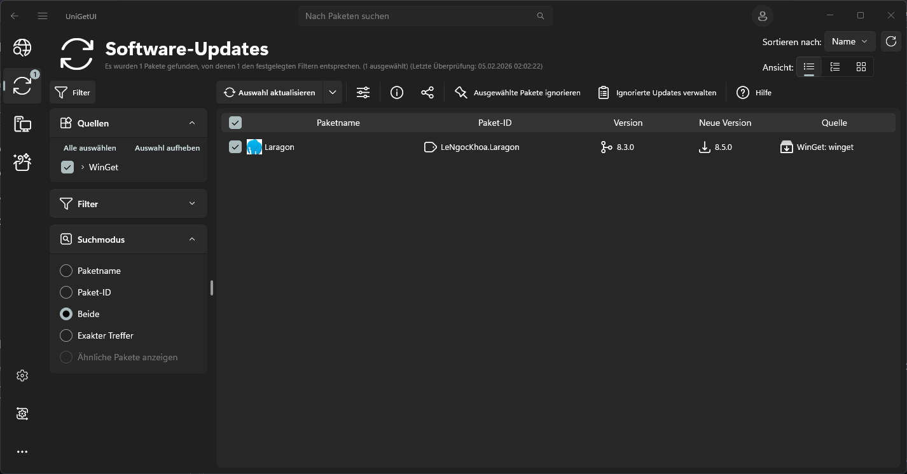

# Tipps-und-Tricks / Freeware / System / Softwareverwaltung #

## Übersicht ##

- UniGetUI

## UniGetUI ##

Name     | Preis     | Website                                | Anbieter      | OS      | Sprache
---------|:---------:|:--------------------------------------:|:-------------:|:-------:|:---------:
UniGetUI | kostenlos | [www.marticliment.com][uniget] (engl.) | Martí Climent | Windows | multi/deu

[uniget]: https://www.marticliment.com/unigetui/ "https://www.marticliment.com"

**UniGetUI ist eine übersichtliche und schnelle Benutzeroberfläche für viele bekannte Paketmanager unter Windows 10 und 11 – darunter Winget, Scoop, Chocolatey, Pip, NPM, .NET Tool und die PowerShell Gallery.**

UniGetUI kann Programme aus diesen Paketquellen ganz einfach **herunterladen, installieren, aktualisieren und wieder entfernen**. Die Auswahl reicht von alltäglicher Software wie Browsern oder PDF‑Readern bis hin zu speziellen Tools wie vim für Windows, die man oft gar nicht kennt.

Doch das Programm kann noch mehr: UniGetUI bietet praktische Funktionen für fortgeschrittene Nutzer. Dazu gehören **das Sichern und Wiederherstellen deiner installierten Pakete** oder das **gleichzeitige Installieren und Entfernen vieler Programme** – ideal, um einen neuen Laptop aufzuräumen oder eine frühere Software‑Umgebung schnell wiederherzustellen.

UniGetUI kann Programme auch **automatisch aktuell halten**. Wenn dies nicht gewünscht ist, informiert es stattdessen über verfügbare Updates.

### Screenshot ###

---
