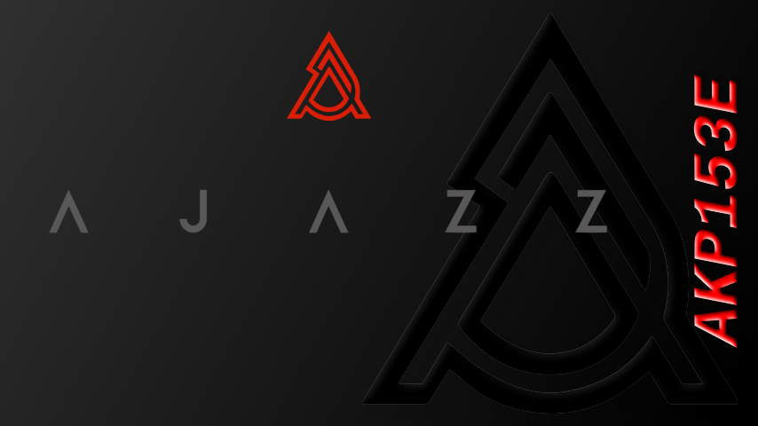

AJAZZ APK153E

## Kompatible Produkte ##

Dieses Gerät wird von vielen verschiedenen Anbietern mit unterschiedlichen Bezeichnungen angeboten. Die Preise können durchaus stark variieren.

### Tabelle von Anbietern/Modellbezeichnungen ###

Anbieter    | Modell           | Hinweise
:----------:|:----------------:|:-----------:
AJAZZ       | APK153E          |
Mars Gaming | MSD-ONE/MSD-ONEW | schwarz/weiß
soomfon     | XF-CN001         |
XYSTEC      | ZX-5540/ZX-5541  | schwarz/weiß

## Boot Screen ##

Der Boot Screen dieses Pads hat eine Auflösung von 854×480 Pixel und kann in der offiziellen Software eingestellt werden.

### Beispiel ###

*Boot Screen AJAZZ APK153E*

## Alternative Software ##

Mit dieser Software soll dieses Makro-Keypad auch unter Linux lauffähig sein. Dieses Gerät wird allerdings nicht offiziell sondern per Plugin unterstützt.

- [OpenDeck](https://github.com/nekename/OpenDeck "https://github.com")  
  Linux/Windows/macOS

