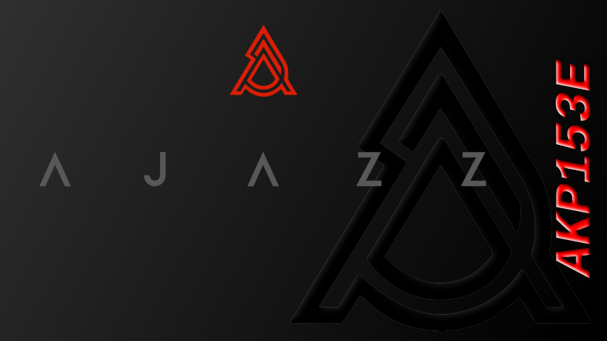

AJAZZ APK153E

## Kompatible Produkte ##

Dieses Gerät wird von vielen verschiedenen Anbietern mit unterschiedlichen Bezeichnungen verkauft. Das bekannteste Gerät ist wahrscheinlich das *MiraBox 293S*. Die Preise können durchaus stark variieren.

### Tabelle von Anbietern/Modellbezeichnungen ###

Diese Tabelle ist nicht vollständig, zeigt aber einen kleinen Überblick über Anbieter und Bezeichnungen:

Anbieter    | Modell           | Hinweise     | Software Win
:----------:|:----------------:|:------------:|:-------------:
AJAZZ       | APK153E          |              | [ajazz.key123.vip](https://ajazz.key123.vip/win)
FHOUU       |                  |              | [key123.vip](https://key123.vip/win)
Mars Gaming | MSD-ONE/MSD-ONEW | schwarz/weiß |
MiraBox     | 293S             |              |
soomfon     | XF-CN001         |              |
XYSTEC      | ZX-5540/ZX-5541  | schwarz/weiß | [xystec.key123.vip](https://xystec.key123.vip/win)

## Boot Screen ##

Der Boot Screen dieses Pads hat eine Auflösung von 854×480 Pixel und kann in der offiziellen Software eingestellt werden.

### Beispiel ###

*Boot Screen AJAZZ APK153E*

## Alternative Software ##

Mit dieser Software soll dieses Makro-Keypad auch unter Linux lauffähig sein. Dieses Gerät wird allerdings nicht offiziell sondern per Plugin unterstützt:

- [OpenDeck](https://github.com/nekename/OpenDeck "https://github.com")  
  Linux/Windows/macOS

