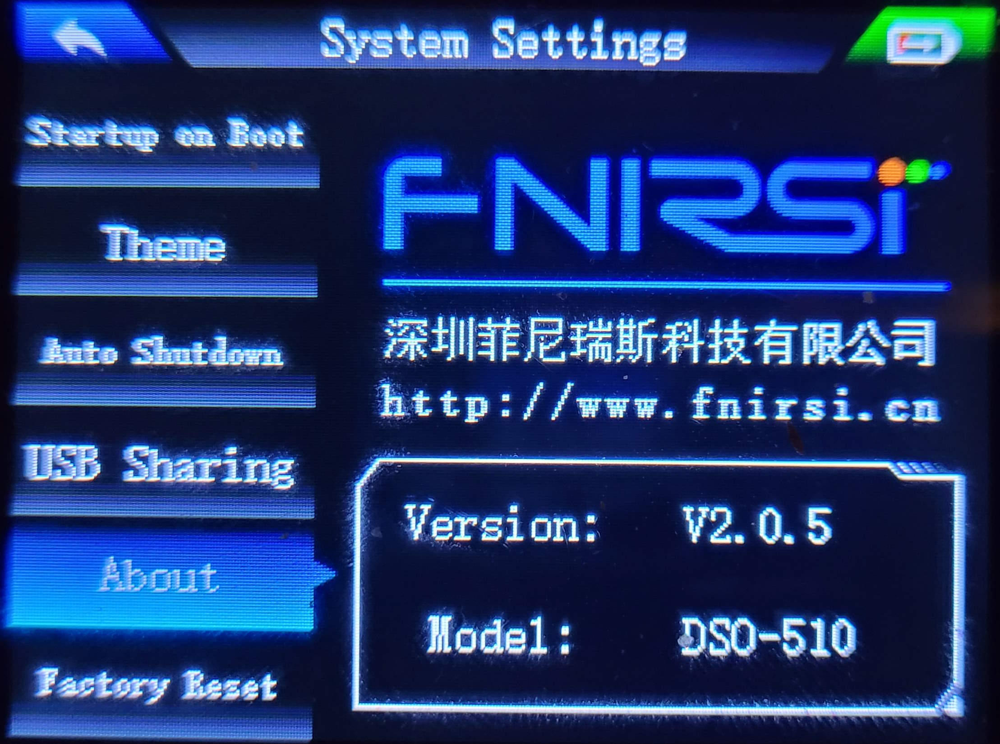

# FNIRSI DSO-510 #

Digital Storage Oscilloscope

## Produkt-Parameter ##

| Engl. Bezeichnung       | Eigenschaft                 | Wert                                                    |
|-------------------------|:---------------------------:|---------------------------------------------------------|
| Sample rate             | Abtastrate                  | 48 MS/s                                                 |
| Bandwith                | Bandbreite                  | 10 MHz                                                  |
| Vertical sensitivity    | Vertikale Empfindlichkeit   | 10 mV/div – 10 V/div                                    |
| Time Base Range         | Zeitbasisbereich            | 50 ns - 20 s                                            |
| Voltage range           | Spannungsbereich ×1         | ± 40 V（Vpp: 80 V)                                      |
| Voltage range           | Spannungsbereich ×10        | ± 400 V（Vpp: 800 V)                                    |
| Trigger Mode            | Auslöse-Modus               | Automatisch/Normal/Einzeln                              |
| Trigger Edge            | Auslösekante                | Ansteigende Flanke / Abfallende Flanke                  |
| Coupling                | Anbindung                   | Gleichstrom/Wechselstrom                                |
| Square wave calibration | Rechteckwellen-Kalibrierung | Frequenz: 1 kHz; Tastverhältnis: 50 %; Amplitude: 3,3 V |

---

## Bedeutung der Anschlussbezeichnungen ##

| Anschluss | Bedeutung                    | Funktion                              |
|:---------:|------------------------------|---------------------------------------|
| DSO       | Digital Storage Oscilloscope | Eingang zum Messen von Signalen       |
| DDS       | Direct Digital Synthesis     | Ausgang zum Erzeugen von Testsignalen |

### DSO = Digital Storage Oscilloscope ###

Das ist der Oszilloskop‑Eingang.

Hier misst du Signale – Spannungskurven, Frequenzen, Rechtecksignale usw. Das Gerät arbeitet als Digitales Speicheroszilloskop, daher die Abkürzung.

### DDS = Direct Digital Synthesis ###

Das ist der Signalgenerator‑Ausgang.

DDS bezeichnet ein Verfahren, bei dem Wellenformen digital erzeugt und dann ausgegeben werden. Der DSO‑510 kann damit 13 verschiedene Wellenformen erzeugen (Sinus, Rechteck, Sägezahn usw.) bis 50 kHz.
