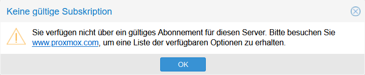
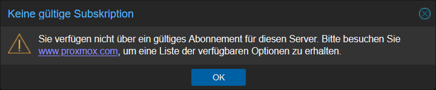
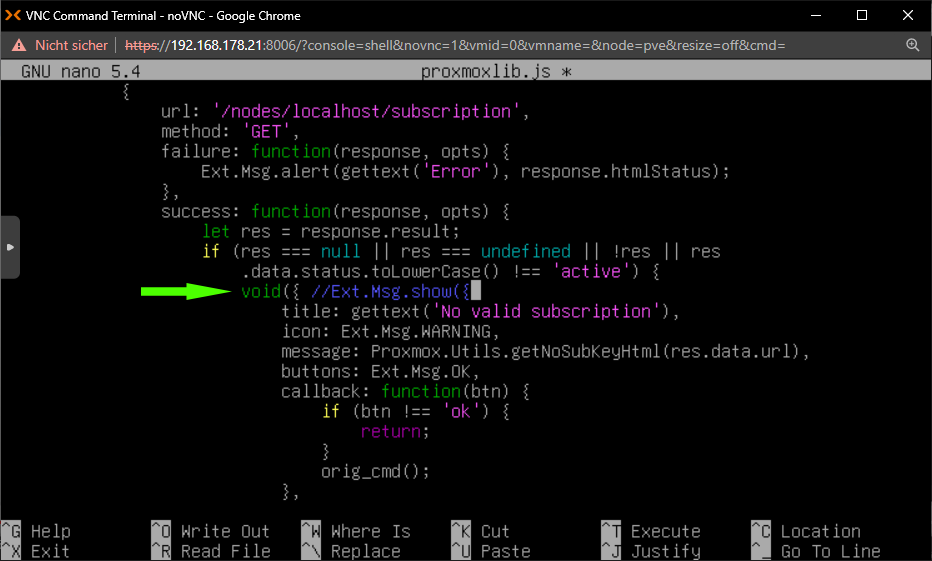

# Tipps und Tricks&nbsp;– Proxmox
Tipps und Tricks für Computer und Internet.
---

## Proxmox VE Helper-Scripts

**Proxmox VE Helper-Scripts** ist eine Sammlung von Tools zur Vereinfachung der Einrichtung und Verwaltung von **Proxmox Virtual Environment (VE)**. Ursprünglich von _[tteck](https://github.com/tteck/Proxmox)_ erstellt, werden diese Skripte nun von der _Community_ weitergeführt. Ziel ist es, die Arbeit von tteck zu bewahren und zu erweitern, um eine fortlaufende Ressource für Proxmox-Benutzer weltweit zu schaffen.

[helper-scripts.com](https://helper-scripts.com/)  
[github.com](https://github.com/community-scripts/ProxmoxVE)

---

## ‚Keine gültige Subskription‘–Hinweis umgehen

* [Manuell](ReadMe.md#manuell)
* [Automatisiert per Skript](ReadMe.md#automatisiert-per-skript)

Proxmox ist Open Source und in der **Community-Edition** *kostenlos*, trotzdem weist der Anbieter ständig darauf hin, dass *kein gültiges Abonnement* besteht.

  



Dieser Hinweis kann umgangen werden.

(Getestet mit Version 7.4-13 – 8.4.1)

### Manuell

In der Shell folgende Befehle nacheinander eingeben:

```
cd /usr/share/javascript/proxmox-widget-toolkit/
cp proxmoxlib.js proxmoxlib.js.backup
nano proxmoxlib.js
```

Suche nach folgendem Inhalt: 

``Ext.Msg.show``

Schreibe folgendes vor diesen Eintrag:

```
void({ //
```



Dann abspeichern [Strg]+[O] und verlassen [Strg]+[X].

Anschließend den Browser neu laden ([F5]-Taste) oder den Dienst neu starten mit:

``systemctl restart pveproxy.service``

### Automatisiert per Skript

Dieses Skript einfach in die Shell kopieren und mit [EINGABE] ausführen:

```
sed -Ezi.bak "s/(Ext.Msg.show\(\{\s+title: gettext\('No valid sub)/void\(\{ \/\/\1/g" /usr/share/javascript/proxmox-widget-toolkit/proxmoxlib.js && systemctl restart pveproxy.service
```

Anschließend den Browser neu laden ([F5]-Taste).

