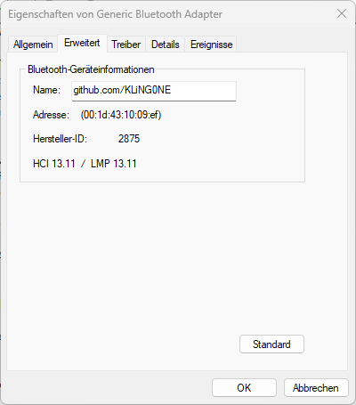

# Bluetooth-Version in Windows anzeigen

Hier wird dargestellt, wie in Windows die Bluetooth-Version angezeigt werden kann.

## Methode: Über den Geräte-Manager

- Geräte-Manager öffnen. – Z. B. `Windows-Taste + X` und „Geräte-Manager“.
- Suche nach dem Eintrag „Bluetooth“ und klicke auf den kleinen Pfeil, um die Liste zu erweitern.
- Rechtsklicke auf deinen Bluetooth-Adapter (z. B. „Intel Wireless Bluetooth“ oder „Realtek Bluetooth Adapter“) und wähle „Eigenschaften“.
- Wechsle zum Tab „Erweitert“ oder „Details“.
- Wähle im Dropdown-Menü „Bluetooth-Radio-Unterstützte Version“ oder „Bluetooth-Version“ (je nach Gerät).
- Dort siehst du die LMP-Version (Link Manager Protocol). Diese Zahl zeigt indirekt die Bluetooth-Version an.

## LMP-Version (Link Manager Protocol)

## LMP-Versionen und ihre Bluetooth-Entsprechungen

In folgender Tabelle werden die LMP-Version (Link Manager Protocol) entsprechend der Bluetooth-Version angezeigt:

| LMP-Version | Bluetooth-Version | Jahr der Einführung  | Maximale Reichweite       |
|-------------|-------------------|----------------------|----------------------------|
| 0           | 1.0b              | 1999                 | ca. 10 m                   |
| 1           | 1.1               | 2001                 | ca. 10 m                   |
| 2           | 1.2               | 2003                 | ca. 10 m                   |
| 3           | 2.0 + EDR         | 2004                 | ca. 10 m                   |
| 4           | 2.1 + EDR         | 2007                 | ca. 10 m                   |
| 5           | 3.0 + HS          | 2009                 | ca. 10 m (24 Mbit/s via Wi-Fi) |
| 6           | 4.0               | 2010                 | bis zu 50 m (Low Energy)  |
| 7           | 4.1               | 2013                 | bis zu 100 m              |
| 8           | 4.2               | 2014                 | bis zu 100 m              |
| 9           | 5.0               | 2016                 | bis zu 240 m              |
| 10          | 5.1               | 2019                 | bis zu 240 m              |
| 11          | 5.2               | 2020                 | bis zu 240 m              |
| 12          | 5.3               | 2021                 | bis zu 240 m              |
| 13          | 5.4               | 2023                 | bis zu 240 m              |
| 14          | 6.0 (geplant)     | voraussichtlich 2025 | tbd (vermutlich >240 m)   |

##### Beispiel

Wenn „LMP 9“ angezeigt wird, unterstützt das Gerät Bluetooth 5.0.

##### Hinweis

- Die LMP-Version zeigt an, welche Bluetooth-Kernfunktionen das Gerät maximal unterstützt.
- EDR = Enhanced Data Rate (Erhöhte Datenrate)
- HS = High Speed (Hohe Geschwindigkeit)
- Neuere Versionen wie Bluetooth 5.x und 6.0 bieten Verbesserungen bei Reichweite, Energieeffizienz, Audioqualität (LE Audio) und Verbindungsstabilität.
- Die tatsächliche Reichweite hängt stark von der Umgebung, Antennenleistung und Energieklasse ab.
- Bluetooth 5.0 und höher bieten **LE (Low Energy) Long Range,** was die Reichweite deutlich erhöht – allerdings bei reduzierter Datenrate.
