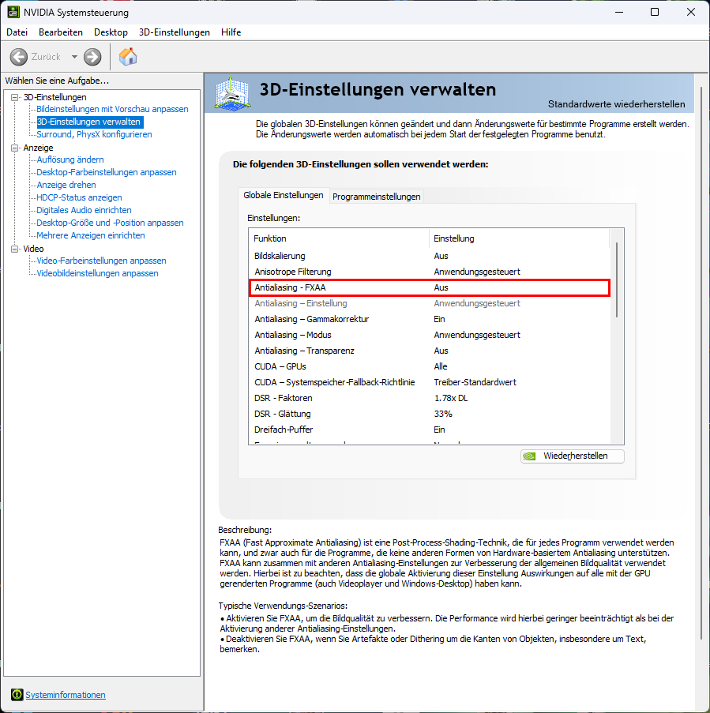

# Tipps und Tricks / Windows / Treiber / GeForce FXAA
<small>TIPPS UND TRICKS FÜR COMPUTER UND INTERNET</small>

## GeForce FXAA – Unscharfe Textdarstellung in Programmen vermeiden

#### Beschreibung:
FXAA (Fast Approximate Antialiasing) ist eine Post-Process-Shading-Technik, die für jedes Programm verwendet werden kann, und zwar auch für die Programme, die keine anderen Formen von Hardware-basiertem Antialiasing unterstützen. FXAA kann zusammen mit anderen Antialiasing-Einstellungen zur Verbesserung der allgemeinen Bildqualität verwendet werden.

Hierbei ist zu beachten, dass die globale Aktivierung dieser Einstellung Auswirkungen auf alle mit der GPU gerenderten Programme (auch Videoplayer und Windows-Desktop) haben kann.

#### Typische Verwendungs-Szenarios:
* Aktivieren Sie FXAA, um die Bildqualität zu verbessern. Die Performance wird hierbei geringer beeinträchtigt als bei der Aktivierung anderer Antiahasing-Einstellungen.
* Deaktivieren Sie FXAA, wenn Sie Artefakte oder Dithering um die Kanten von Objekten, insbesondere um Text, bemerken. 

*Quelle:* Nvidia GeForce Treiber-Einstellungen

---

[KLiNG0NE](https://github.com/KLiNG0NE/) / [Tipps-und-Tricks](https://github.com/KLiNG0NE/Tipps-und-Tricks) / [Windows](../README.md) / [Treiber](README.md)
