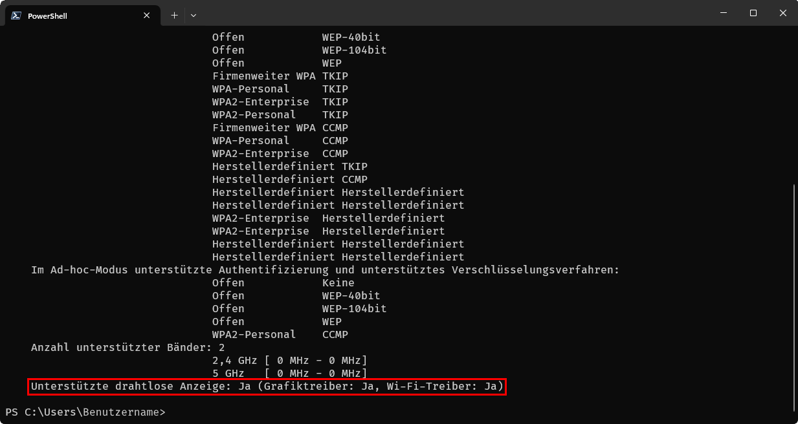

# Tipps und Tricks / Windows / Treiber / Miracast
<small>TIPPS UND TRICKS FÜR COMPUTER UND INTERNET</small>

## Miracast

Miracast ist ein Peer-to-Peer-Funk-Screencast-Standard, der 2012 von der Wi-Fi Alliance definiert wurde. Der Standard ermöglicht unter anderem, den Bildschirminhalt eines Rechners, auf einen TV-Bildschirm zu übertragen.

### Miracast – Prüfen ob der PC drahtlos Videos übertragen kann

* Eingabeaufforderung/Terminal öffnen  
  Z. B. mit der Tastenkombination [Windows]+[R] und dann ``cmd`` eingeben
* Anschließend folgenden Befehl eingeben:
```
netsh wlan show drivers
```

* In der letzten Zeile der Ausgabe sollte *„Unterstützte drahtlose Anzeige: Ja“* stehen, dann ist eine drahtlose Übertragung möglich:



*Quelle:* [www.vive.com](https://www.vive.com/de/support/focus3/category_howto/casting-to-pc-casting-to-pc-miracast-unterst%C3%BCtzung-%C3%BCberpr%C3%BCfen.html)

---

[KLiNG0NE](https://github.com/KLiNG0NE/) / [Tipps-und-Tricks](https://github.com/KLiNG0NE/Tipps-und-Tricks) / [Windows](../README.md) / [Treiber](README.md)


